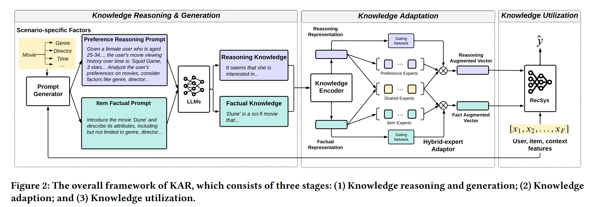
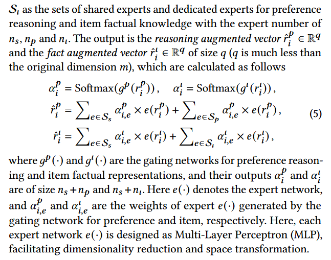
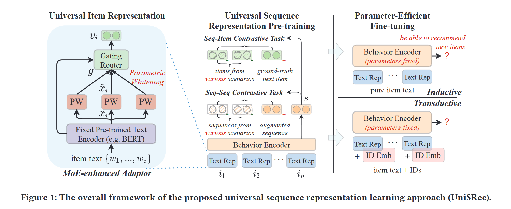
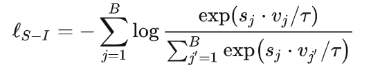
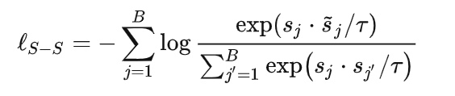
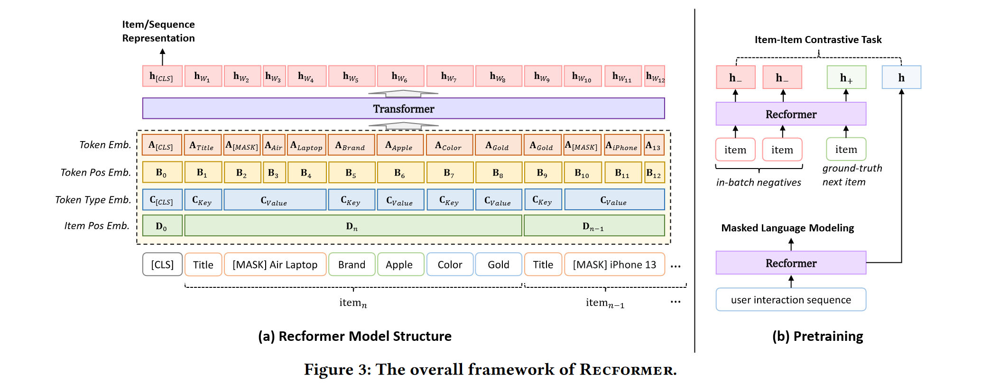
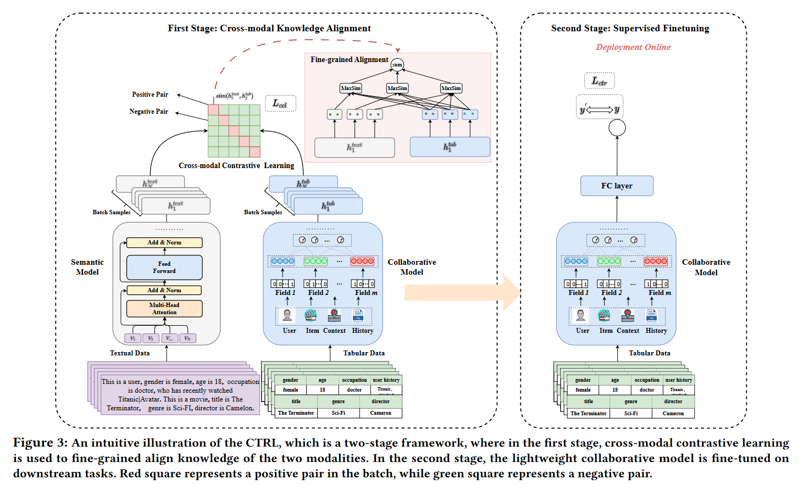
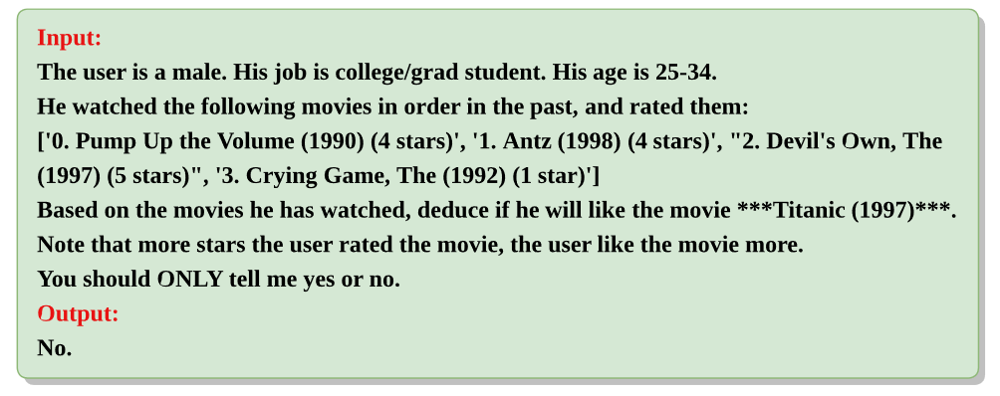
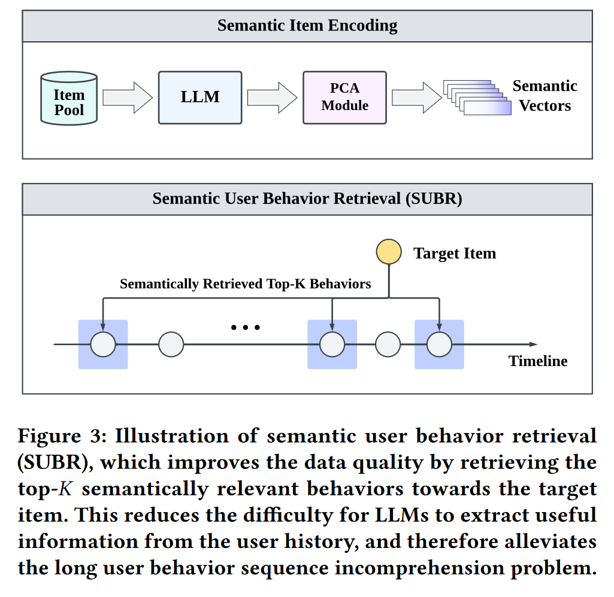

# Research-paper-notes

zwm的论文阅读笔记，聚焦于recommender systems, educational data mining, reinforcement learning. 笔记顺序按阅读的时间顺序记录。

## Towards Open-World Recommendation with Knowledge Augmentation from Large Language Models

这是实验室学长姐在2023年初发表的文章，也是一个best paper。这篇文章主要聚焦于利用LLM的universal open-world knowledge来辅助进行推荐，是模型无关的。框架叫KAR，从LLMs获取两类外部知识：关于用户偏好的推理知识和关于项目的事实性知识。

KAR主要分为三个阶段：

- knowledge reasoning and generation，主要是怎么由数据集产生两方面的知识
- knowledge adaptation，主要是如何对产生的知识进行encoding和alignment
- knowledge utilization，将augmented vectors与现有推荐模型结合

这篇文章我主要要学习的是adaptation模块，这边分为两个部分：knowledge encoder和hybrid-expert adaptor。knowledge encoder很好理解，我也实现了用大语言模型抽取隐层。后者使用了一个MoE模块，聚合不同方面的知识(**what does the "experts" represent here**)

对于如何应用进CTR模型，直接将这些增广向量作为额外的输入特征，允许它们显式地与其他类别特征进行交互。

我觉得这篇文章的壁垒主要在于太贵了，如果生成文本的阶段都用gpt去生成那费用恐怖如斯，但是又不知道一般的13B大模型能不能有与之媲美的生成效果。针对用户情况和题目情况分别生成文本时可借鉴的，两段文本的表征进行聚合后如何嵌入CDM模型也是需要思考的。

## Towards Universal Sequence Representation Learning for Recommender Systems

这是人大和阿里发表的一篇文章，提出了还算有名的UniSRec，也是利用项目的关联描述文本来学习跨不同场景的可迁移表示。其实我不太懂这里cross-domain和transfer learning的东西，只是想看一下这篇文章是如何将文本利用起来的。

这篇文章主要通过两方面的学习：

- 通用商品表征：通过对商品的文本进行BERT编码得到对应的表征；为了得到同性语义并且环节不同域之间的语义差异，作者提出带参数的白话特征进行变换，用MoE的方法进行处理
- 通用序列表征：通过Transformer对序列进行编码，为了缓解不同域中的行为序列的反应的行为模式的差异性，以及缓解跷跷板问题。对比学习构建序列-商品对比任务和序列序列对比任务捕获相关性。

一些没见过的点：

- 参数白化进行语义转换：BERT为一般文本引入了非平滑的各向异性语义空间。于是用线性变换变换原始BERT表征。

- 通过MoE进行域融合和适应：为一个商品学习多个白化embedding，利用这些embedding的自适应组合作为通用商品表征。

- sequence-item对比学习：对于给定的序列，采用跨域商品作为负样本。这里s是指序列，v是指应该的下一个商品。B的batch是来自不同域的。

  

- 相比较而言，sequence-sequence用的就是老套路了，增强序列与其他序列进行对比：

  

这篇文章主要是针对跨域的序列预测，这边用了对比学习的方法去分别对sequence和item操作，感觉可以借鉴到KT上，主要还是结合text先进行adaptation。其实这个方法好像挺common的。

## Text Is All You Need: Learning Language Representations for Sequential Recommendation

这篇文章也是讲序列预测的，是lqy学长在组会分享过的一篇文章。这篇文章也是利用了文本，将每个item整理成一个sentence，将item sequence formulate成一个sequence of sentences。这篇文章提出的框架叫做**RECFORMER**。

像这种用文本的motivation好像都提了如果基于ID就不能用于跨域推荐和场景的迁移。具体的做法是将物品表示为键值属性对，可以包含各个方面的文本信息，用Longformer对序列进行编码。

对于item i，它的sentence可以表示为$T_i=\{k_1, v_1, k_2, v_2,\cdots,k_m,v_m\}$

model input 表示为$X=\{[CLS],T_n, T_{n-1}, \cdots,T_1\}$

它这里embedding分为四个，先看图：

- Token Embedding：表征对应的token，商品属性中文字token对应的embedding，这样就脱离了商品ID的embedding了
- Token Position Embedding：表征token在序列中的位置
- Token type Embedding：表征token的类型，有三种，分别是CLS，key，和value
- Item Position Embedding：表征商品在序列中的位置

对于给定序列中的一个word w，表征表示为$E_w = LayerNorm(A_w+B_w+C_w+D_w)$

序列表征表示为$E_X=[E_{[CLS]},E_{w_1},\cdots,E_{w_l}]$

Recformer计算d维单词表征的方式$[h_{CLS},h_{w_1},\cdots,h_{w_l}]=Longformer(E_X)$

如果对于单个商品，那么就构造sentence$X= \{[CLS], T_i\}$得到商品表征$h_i$

那么就用余弦相似性来预测下一个商品（序列和item）

我们关注这个框架的学习模式，要学习哪些参数，固定哪些东西。

- 首先是预训练：

  - Masked Language Modeling(MLM)
  - item-item对比学习。使用真实的下一个交互item作为正样本。负样本采用当前batch其他序列中对应的真实的下一个交互item。

- 两阶段微调。保持一个商品特征矩阵，**这个矩阵是从Recformer中编码得到的**。

  阶段1中每个epoch会把item进行编码，更新矩阵，相当于重新encode，模型和矩阵都会更新；

  阶段2中冻结特征矩阵，更新模型中的参数。

## CTRL: Connect Collaborative and Language Model for CTR Prediction

这是华为的一个工作，表格数据和转换后的文本被视作两种不同的模态，分别输入到协同CTR模型和预训练语言模型中。主要的工作就在于一个对齐，然后对CTR模型进行微调。相当于是找一个对齐的东西辅助tune CTR模型。**在线推理时，只用轻量级微调后的CTR模型。**

他这里好像没有具体写用什么方法进行text的embedding，应该就是可以直接用LLM做一个抽取表征。两边的模型分别得到抽取的特征：
$$
h^{tab}=M_{col}(x^{tab})W^{tab}+b^{tab}
\\
h^{text}=M_{sem}(x^{text})W^{text}+b^{text}
$$
这边就是应用contrastive learning的方法分别对text和tab两边的数据用loss。For example，$L^{text2tab}=-\frac{1}{N}\sum\limits_{k=1}^Nlos\frac{exp(sim(h_k^{text},h_k^{tab})/\tau)}{\sum\limits_{j=1}^Nexp(sim(h_k^{text},h_j^{tab})/\tau)}$

这边其实提到了fine-grained对齐，也就是加一层W和b。

最后的finetune其实就是仅仅用CTR模型。

这篇文章好像构思不算复杂，其实就是应用了一个对齐，然后只tune一边，利用语言模型这边去辅助调整一下CTR模型。这个思路如果应用于CDM的话应该实现起来是不难的，就是改变一下训练的模式，以及加入对比学习（抽取隐层已经写好了）。但是这篇文章的代码还没有开源（

## ReLLa: Retrieval-enhanced Large Language Models for Lifelong Sequential Behavior Comprehension in Recommendation

同学的paper，听学长说做的很有效果，于是也拜读一下。这篇文章主要是用了retrieval的方法去直接应用大模型进行推理，然后如果用few-shot的话就是选取一部分训练语料这样去构建训练数据然后tune大模型（这里用的是vicuna-13B）

我觉得首先需要学习的是这篇文章对于prompt的设计，从而让大模型直接去推理对于一个物品，是否会点击。（之前竟然没看过这样用大模型去做ctr的，是我孤陋寡闻了）

这里相当于把一个人相关的浏览信息连接了一下，并且附上他的喜好，然后让大模型去推理需要预测的电影，让它直接输出结果。

然后这篇文章的主要工作就是如何进行retrieval，用文本表示。这里采用的方法就是提前对题目的信息用大模型进行encoding，然后从隐层抽取表征，用PCA降维得到一堆向量。之后检索的时候就直接用余弦相似度去减索了，然后拼接成prompt。

这篇文章还提到了可以将recent和semantically similar的进行混合，可以更好预测，这都是后面的trick了，可以不管。

还有一个点在于，这篇文章提到了few-shot，在这里few-shot的意思是选取N个这样的prompt（即（x,y）对）来tune大模型，从而让大模型更好地去做预测，效果是出乎意料的好，可以击败原来full shot的performance.

总而言之，这篇文章好像没有什么框架上的创新点，主要就是在于prompt engineering，用了retrieval的方法去构建prompt让大模型直接去预测。但是如果用在教育上，其实教育的数据是否能支撑这样的方法其实是未知的，文本信息毕竟不如推荐的丰富。

